# OverTheWire Bandit Writeup (Level 0–20)

**Author:** Livinkumar J

This document contains detailed solutions, explanations, and mapped screenshots for Bandit Levels 0–20. All screenshots are placed at the bottom of each level section.

---

## Level 0 → Level 1

### Goal

Login using SSH and read the `readme` file to obtain the password.

### Commands Used

```
ssh bandit0@bandit.labs.overthewire.org -p 2220
ls
cat readme
```

### Explanation

* Connected to Bandit server using SSH on port 2220
* Listed available files
* Opened the readme file to retrieve the password

### Screenshot


---

## Level 1 → Level 2

### Goal

Password stored in a file named `-`

### Commands Used

```
ls
cat ./-
```

### Explanation

* `-` is treated as an option by default
* Using `./-` tells Linux to treat it as a file

### Screenshot

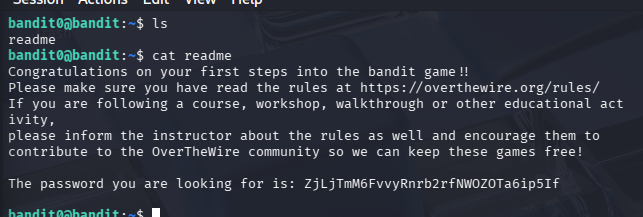

---

## Level 2 → Level 3

### Goal

Password inside a file with spaces in its name

### Commands Used

```
ls
cat "spaces in this filename"
```

### Explanation

* Quotes allow reading files that contain spaces

### Screenshot

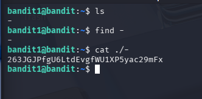

---

## Level 3 → Level 4

### Goal

Password stored in a hidden file

### Commands Used

```
ls -a
cat .hidden
```

### Explanation

* `-a` shows hidden files
* `.hidden` contains the password

### Screenshot

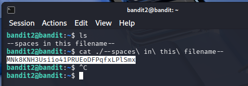

---

## Level 4 → Level 5

### Goal

Find the human-readable file

### Commands Used

```
ls
file ./*
cat ./-file07
```

### Explanation

* `file` identifies readable vs binary files
* Only one file is readable

### Screenshot


---

## Level 5 → Level 6

### Goal

Find a file that is:

* 1033 bytes
* Not executable
* Human readable

### Commands Used

```
find . -type f -size 1033c ! -executable
cat <filename>
```

### Explanation

* Used `find` with filters to locate the exact file

### Screenshot

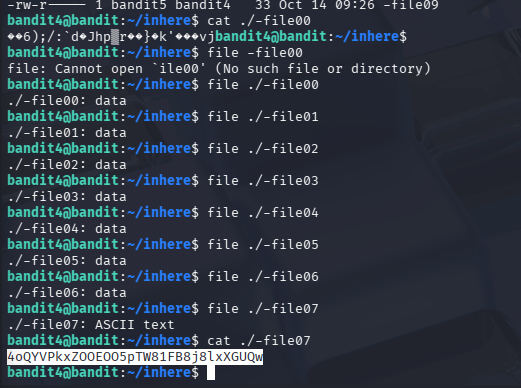

---

## Level 6 → Level 7

### Goal

Find file owned by user `bandit7` and group `bandit6`

### Commands Used

```
find / -user bandit7 -group bandit6 -size 33c 2>/dev/null
cat <file>
```

### Explanation

* Searched entire system
* Ignored permission errors

### Screenshot

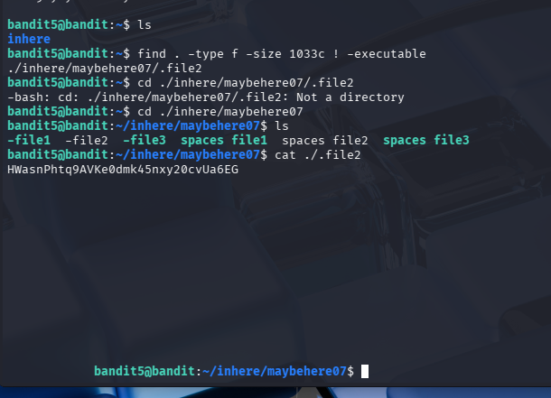

---

## Level 7 → Level 8

### Goal

Password stored next to the word "millionth"

### Commands Used

```
grep millionth data.txt
```

### Explanation

* `grep` searches for a specific word in a file

### Screenshot

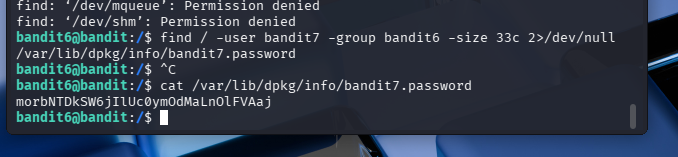

---

## Level 8 → Level 9

### Goal

Find the unique line in the file

### Commands Used

```
sort data.txt | uniq -u
```

### Explanation

* Sorting groups identical lines
* `uniq -u` shows the line that appears once

### Screenshot

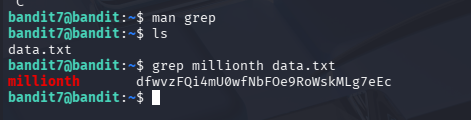

---

## Level 9 → Level 10

### Goal

Password hidden in a binary file

### Commands Used

```
strings data.txt | grep "="
```

### Explanation

* `strings` extracts readable text
* `grep` filters useful output

### Screenshot

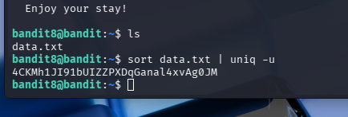

---

## Level 10 → Level 11

### Goal

Base64 encoded password

### Commands Used

```
base64 -d data.txt
```

### Explanation

* Decoded Base64 content

### Screenshot

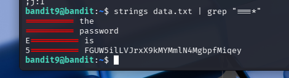

---

## Level 11 → Level 12

### Goal

ROT13 encrypted password

### Commands Used

```
cat data.txt | tr 'A-Za-z' 'N-ZA-Mn-za-m'
```

### Explanation

* Used character translation to decode ROT13

### Screenshot

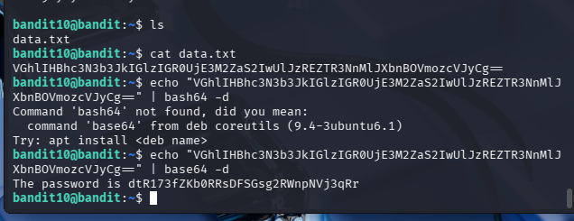

---

## Level 12 → Level 13

### Goal

Extract password from multiple compressed layers

### Commands Used

```
xxd -r data.txt > file
gzip -d
bzip2 -d
tar -xvf
```

### Explanation

* Reversed hex dump
* Decompressed files step by step

### Screenshot

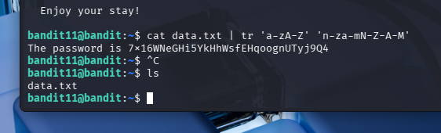

---

## Level 13 → Level 14

### Goal

Login using private SSH key

### Commands Used

```
ssh -i sshkey.private bandit14@localhost -p 2220
```

### Explanation

* Used provided private key for authentication

### Screenshot

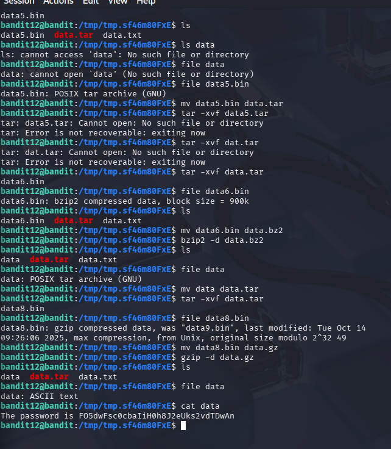

---

## Level 14 → Level 15

### Goal

Send current password to port 30000

### Commands Used

```
nc localhost 30000
```

### Explanation

* Used Netcat to communicate with service

### Screenshot

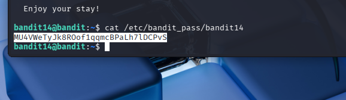

---

## Level 15 → Level 16

### Goal

Connect using SSL encryption

### Commands Used

```
openssl s_client -connect localhost:30001
```

### Explanation

* Opened secure SSL connection
* Submitted password

### Screenshot

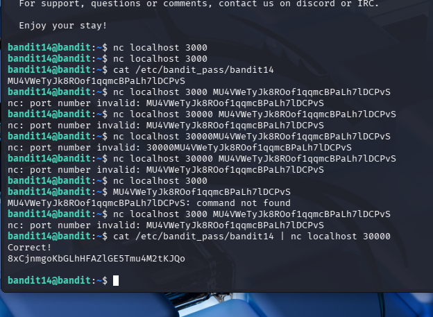

---

## Level 16 → Level 17

### Goal

Find correct port running SSL service

### Commands Used

```
nmap -p 31000-32000 localhost
```

### Explanation

* Scanned port range
* Identified working SSL port

### Screenshot

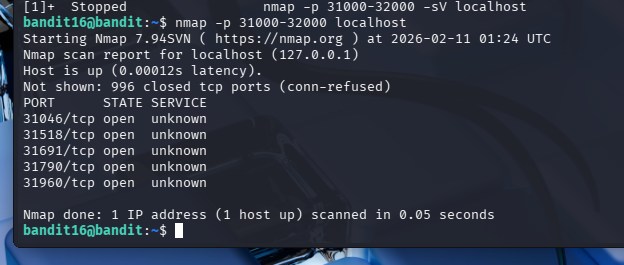

---

## Level 17 → Level 18

### Goal

Find difference between two files

### Commands Used

```
diff passwords.old passwords.new
```

### Explanation

* `diff` shows changed line which contains password

### Screenshot

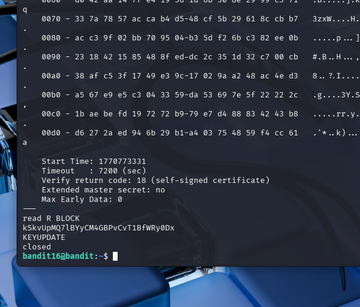

---

## Level 18 → Level 19

### Goal

Bypass restricted shell

### Commands Used

```
ssh bandit18@bandit.labs.overthewire.org -p 2220 "cat readme"
```

### Explanation

* Executed command directly during login

### Screenshot

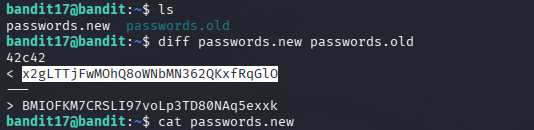

---

## Level 19 → Level 20

### Goal

Use setuid binary to read protected file

### Commands Used

```
./bandit20-do cat /etc/bandit_pass/bandit20
```

### Explanation

* Used special binary with elevated permissions
* Accessed protected password file

### Screenshot

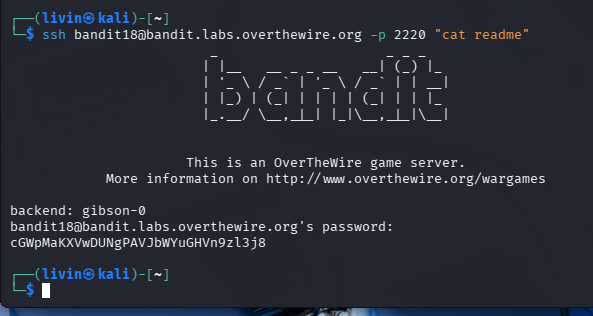

---

## Skills Learned

* Linux navigation
* File handling
* Permissions
* Encoding/Decoding
* Networking basics
* SSH usage
* Port scanning
* Compression handling

---

**Note:** Passwords are intentionally not included for ethical reasons.
