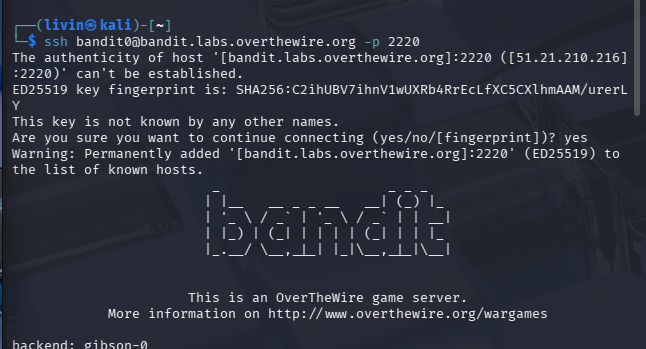

# OverTheWire Bandit Writeups (Level 0–20)
Author: Livinkumar J

This repository contains my learning notes and solutions for OverTheWire Bandit CTF (Level 0–20).

Skills Practiced:
- Linux commands
- File reading techniques
- Permissions
- SSH usage
- Basic enumeration
- Problem-solving mindset

Note: Passwords are not shared for ethical reasons.

--------------------------------------------------

## Level 0 → Level 1

**Goal:**
Login using SSH and find the password in the readme file.

**Commands Used:**

**Explanation:**
- Connected using SSH
- Listed files
- Read the readme file to get the password

**Screenshot:**

--------------------------------------------------

## Level 1 → Level 2

**Goal:**
Password stored in a file named "-"

**Commands Used:**

**Explanation:**
- File name starts with "-"
- Used ./ to avoid confusion with command options

**Screenshot:**

--------------------------------------------------

## Level 2 → Level 3

**Goal:**
Password stored in a file with spaces in the name

**Commands Used:**

**Explanation:**
- Used quotes to handle spaces in file name

**Screenshot:**

--------------------------------------------------

## Level 3 → Level 4

**Goal:**
Password inside a hidden file

**Commands Used:**

**Explanation:**
- Used -a to show hidden files

**Screenshot:**

--------------------------------------------------

## Level 4 → Level 5

**Goal:**
Find password in human-readable file

**Commands Used:**

**Explanation:**
- Used file command to identify readable file
- Opened correct file

**Screenshot:**

--------------------------------------------------

## Level 5 → Level 6

**Goal:**
Find file with:
- Human-readable
- 1033 bytes
- Not executable

**Commands Used:**

**Explanation:**
- Used find to search with conditions

**Screenshot:**

--------------------------------------------------

## Level 6 → Level 7

**Goal:**
Find file owned by user bandit7 and group bandit6

**Commands Used:**

**Explanation:**
- Used find across system
- Ignored permission errors

**Screenshot:**

--------------------------------------------------

## Level 7 → Level 8

**Goal:**
Password stored in data.txt next to word "millionth"

**Commands Used:**

**Explanation:**
- Used grep to search keyword

**Screenshot:**

--------------------------------------------------

## Level 8 → Level 9

**Goal:**
Password is the only unique line

**Commands Used:**

**Explanation:**
- Sorted lines
- Found unique value

**Screenshot:**

--------------------------------------------------

## Level 9 → Level 10

**Goal:**
Password in binary file next to "="

**Commands Used:**

**Explanation:**
- Extracted readable text from binary

**Screenshot:**

--------------------------------------------------

## Level 10 → Level 11

**Goal:**
Password encoded with base64

**Commands Used:**

**Explanation:**
- Decoded base64 content

**Screenshot:**

--------------------------------------------------

## Level 11 → Level 12

**Goal:**
Password encrypted with ROT13

**Commands Used:**

**Explanation:**
- Used ROT13 decryption

**Screenshot:**

--------------------------------------------------

## Level 12 → Level 13

**Goal:**
Multiple compression layers

**Commands Used:**

**Explanation:**
- Reversed hex dump
- Extracted multiple compressed files

**Screenshot:**

--------------------------------------------------

## Level 13 → Level 14

**Goal:**
Use SSH private key

**Commands Used:**

**Explanation:**
- Logged in using private key

**Screenshot:**

--------------------------------------------------

## Level 14 → Level 15

**Goal:**
Submit password via netcat

**Commands Used:**

**Explanation:**
- Sent password to port

**Screenshot:**

--------------------------------------------------

## Level 15 → Level 16

**Goal:**
Use SSL connection

**Commands Used:**

**Explanation:**
- Used encrypted connection

**Screenshot:**

--------------------------------------------------

## Level 16 → Level 17

**Goal:**
Find correct port using nmap

**Commands Used:**

**Explanation:**
- Scanned ports
- Found correct SSL service

**Screenshot:**

--------------------------------------------------

## Level 17 → Level 18

**Goal:**
Find difference between files

**Commands Used:**

**Explanation:**
- Compared files
- Found changed password

**Screenshot:**

--------------------------------------------------

## Level 18 → Level 19

**Goal:**
Bypass restricted shell

**Commands Used:**

**Explanation:**
- Executed command during login

**Screenshot:**

--------------------------------------------------

## Level 19 → Level 20

**Goal:**
Use setuid binary

**Commands Used:**

**Explanation:**
- Used special binary to read protected file

**Screenshot:**

--------------------------------------------------
